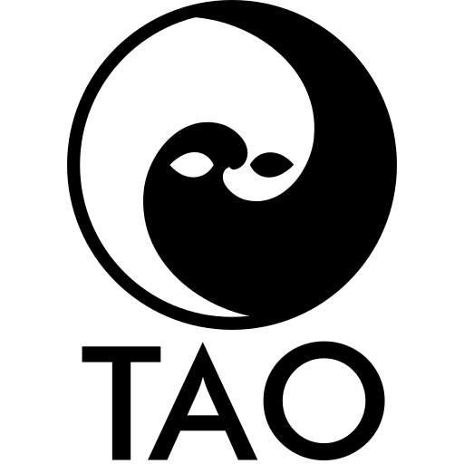

---

Projeto da linguagem Tao. Trabalho Prático da disciplina CCF441 - Compiladores.

## Integrantes

- 3873 - Germano Barcelos dos Santos
- 3051 - Henrique de Souza Santana
- 3890 - Otávio Santos Gomes
- 3877 - Pedro Cardoso de Carvalho Mundim
- 3495 - Vinícius Júlio Martins Barbosa
